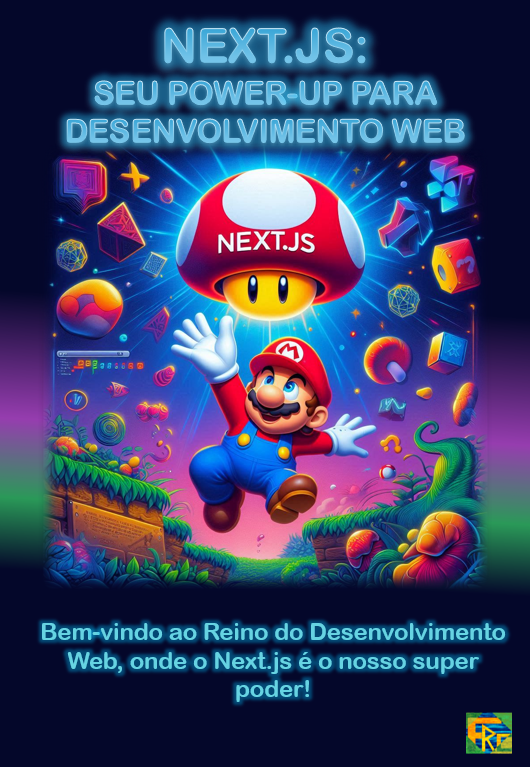

    

-------

# Projeto EBOOK Gerado por I.A.s

 > ℹ️ **NOTE:** Este é o repositório desenvolvido durante o curso no qual fui aluno na plataforma da [DIO](https://dio.me)

### Projeto com o objetivo de gerar um ebook digital com as facilidades das ferramentas de IA. Os principais prompts seguem abaixo.

### <a href="./output/meu_ebook - template.pdf" title="View PDF now"> 📕Clique aqui para ler o ebook</a>

## 💻 Tecnologias utilizadas no projeto

- [Copilot](https://copilot.microsoft.com/)
- [Gemini](https://gemini.google.com/app)
- [ChatGPT](https://chat.openai.com/) 
- [PowerPoint](https://www.microsoft.com/en/microsoft-365/powerpoint)

## 🧠 Prompts

### Gemini：

| Ação | Prompt |
| :------: | - |
|  Título  | Crie um título para o ebook sobre o tema next.js. O ebook é para o nicho de programação e o subnicho é javascript/react. O título deve ser curto e chamativo. Sugira 5 títulos com o tema de super mario bros.|

### ChatGPT：

| Ação | Prompt |
| :------: | - |
| Prompt para imagem | O que você acha do mario pulando para pegar um cogumelo escrito nele next.js / Então escreva um prompt para gerar uma imagem mais assertiva dessa ideia / Traduza esse prompt para inglês|

### Copilot：

| Ação | Prompt |
| :------: | - |
|  Imagem  | A vibrant scene inspired by the Super Mario Bros universe, where Mario, in his classic jumping pose, is reaching out to grab a special mushroom. This mushroom is adorned with the text 'Next.js' vividly and captivatingly. Mario is positioned at the center of the scene, with a background that blends elements from the world of Super Mario with symbols and icons of web development, such as code blocks, React and JavaScript icons, and visual references to the Next.js environment. The scene conveys a sense of dynamism, fun, and discovery, while highlighting the importance of Next.js in this context of learning and exploration in the world of web development                                                        |
| Conteúdo | Faça um texto para ebook com o tema do Super Mario Bros, com foco em next.js, listando as principais diferenças para uso do App Router com exemplos de código {REGRAS} > Explique sempre de uma maneira simples > Deixe o texto enxuto > Sempre traga exemplos de código em contextos reais > Sempre deixe um título sugestivo por tópico > Faça uma introdução sobre o next.js e o que é o app router > Faça pelo menos 5 capítulos > Coloque algumas analogias ao super mario|

## ✨ Features

- Título gerado via Gemini
- Prompt para geração da imagem gerado via ChatGPT
- Imagens e conteúdo gerados via Copilot

## 📚 Materiais

- Imagens utilizadas em `assets`
- ebook gerado durante as aulas em `output`

## 🛠️ Instruções de execução

Utilize os prompts acima nas ferramentas sugeridas para gerar o material base e utilize uma ferramenta de edição de documentos como power point, libreoffice , indesign para diagramação.

## 👨‍💻 Expert

    
    
&nbsp&nbsp&nbspFERNANDO R COSTA 
    &nbsp&nbsp&nbsp
    <a href="https://github.com/fernando-r-costa">
    GitHub</a>&nbsp;|&nbsp;
    <a href="https://www.linkedin.com/in/fernando-r-costa/">LinkedIn</a>

 

---

